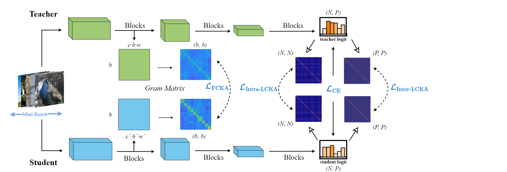
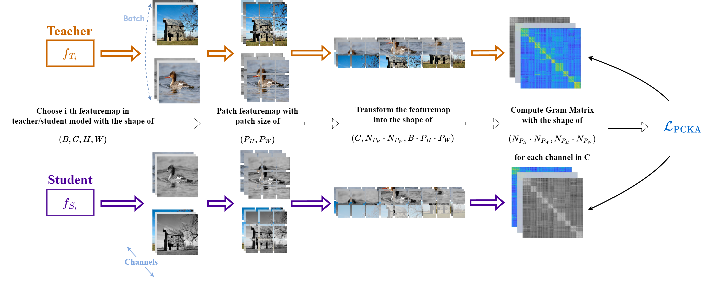
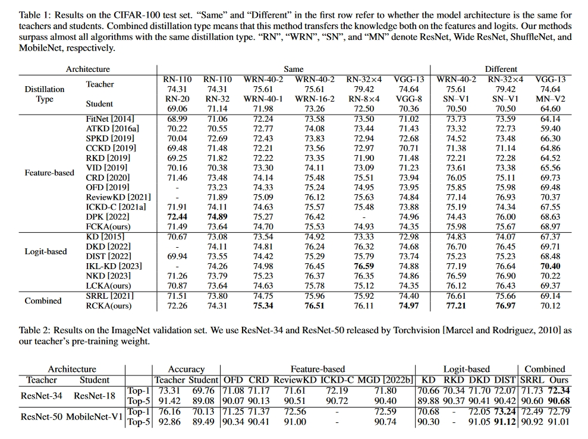
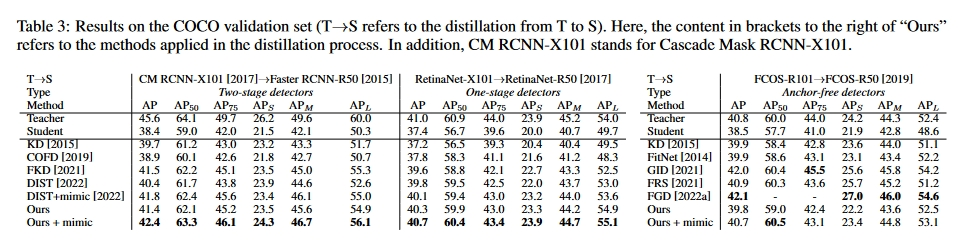
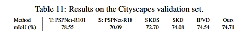

# Rethinking Centered Kernel Alignment in Knowledge Distillation

Offical Implementation of our IJCAI 2024 paper:

> **[Rethinking Centered Kernel Alignment in Knowledge Distillation](https://arxiv.org/abs/2401.11824)** <br>

Authors:

>**<em>Zikai Zhou, Shenyun Hang, Shitong Shao, Linrui Gong</em> and <em>Shaohui Lin*</em>** <br>
> *: Corresponding author

## Main Contribution

(1) We rethink CKA in knowledge distillation from a novel perspective, providing a theoretical reason for why CKA is effective in knowledge distillation.

(2) We propose a Relation Centered Kernel Alignment (RCKA) framework to construct the relationship between CKA and MMD, with less computational source yet comparable performance than previous methods, which verifies our theoretical analysis correctly.

(3) We further dynamically customize the application of CKA for instance-level tasks and propose a Patch-based Centered Kernel Alignment~(PCKA) architecture for knowledge distillation in object detection, which further boosts the performance of previous distillation methods.

(4) We conduct plenty of ablation studies to verify the effectiveness of our method, which achieves SOTA performance on a range of vision tasks.


<div align=left>

</div>
<div align=left>

</div>

## Experiment

### CIFAR-100 and ImageNet-1k:

<div align=left>

</div>

### MS-COCO:

<div align=left>

</div>

### Cityscapes:

<div align=left>

</div>


## Get Started

### Download

First, download our repository:

```bash
git clone https://github.com/shaoshitong/G_VBSM_Dataset_Condensation.git
```
This may take longer than the other repository downloads because we uploaded all the statistics for CIFAR-10/100, Tiny-ImageNet and ImageNet-1k.

### Installation

Our code can be easily run, you only need install following packages:
```bash
pip install -U openmim
mim install mmengine
mim install "mmcv>=2.0.0"

cd mmrazor
pip install -v -e .
```
Note that you need to make sure all versions of packages compatible.

### Run

The implementation of PCKA is in `mmrazor/mmrazor/models/losses/cka_loss.py`.
Noted that if you want to reproduce our experiments, all running code are in `mmrazor/configs/distill/mmdet`(Object Detection) and `mmrazor/configs/distill/mmseg`(Segmentation). You can follow the documents of MMRazor to execute these codes.


**In the future, what will we do?**

- [ ] Upload the code for image classification task.
- [ ] Fix some possible bugs.


### Open model checkpoint and running logs.
All running logs and checkpoint are available in https://pan.baidu.com/s/1bOdAgJmLO4dLXAv1KlX73w
The baidu cloud's password is `2024`.


## If you find some issues, please contact choukai003@gmail.com .

## Citation

If you find our code useful for your research, please cite our paper.

```
@article{Zhou2024RethinkingCK,
  title={Rethinking Centered Kernel Alignment in Knowledge Distillation},
  author={Zikai Zhou and Yunhang Shen and Shitong Shao and Huanran Chen and Linrui Gong and Shaohui Lin},
  journal={ArXiv},
  year={2024},
  volume={abs/2401.11824},
  url={https://api.semanticscholar.org/CorpusID:267069331}
}

@article{Zhou2024RethinkingCK,
  title={Rethinking Centered Kernel Alignment in Knowledge Distillation},
  author={Zikai Zhou and Yunhang Shen and Shitong Shao and Huanran Chen and Linrui Gong and Shaohui Lin},
  journal={IJCAI},
  year={2024},
  volume={abs/2401.11824},
  url={https://api.semanticscholar.org/CorpusID:267069331}
}
```

Our code based on MMRazor, MMDetection and MMSegmentation:

```
@misc{2021mmrazor,
    title={OpenMMLab Model Compression Toolbox and Benchmark},
    author={MMRazor Contributors},
    year={2021}
}

@misc{mmseg2020,
    title={{MMSegmentation}: OpenMMLab Semantic Segmentation Toolbox and Benchmark},
    author={MMSegmentation Contributors},
    year={2020}
}

@article{mmdetection,
  title   = {{MMDetection}: Open MMLab Detection Toolbox and Benchmark},
  author  = {Chen, Kai and Wang, Jiaqi},
  journal= {arXiv preprint arXiv:1906.07155},
  year={2019}
}
```
